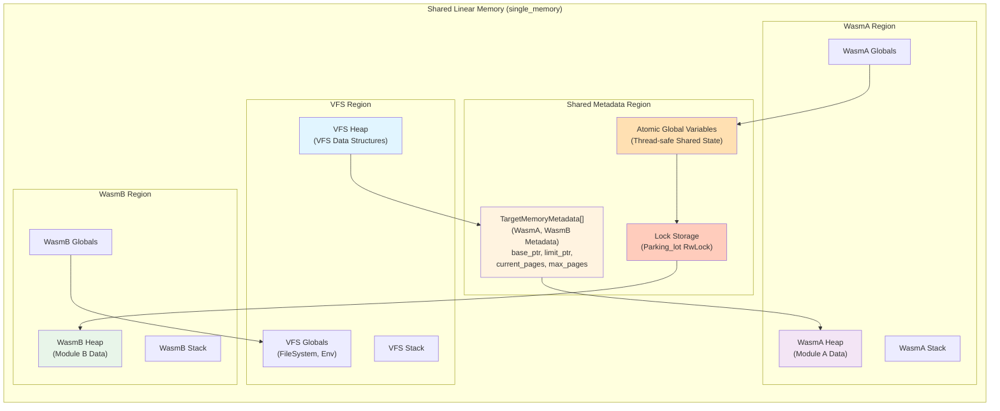
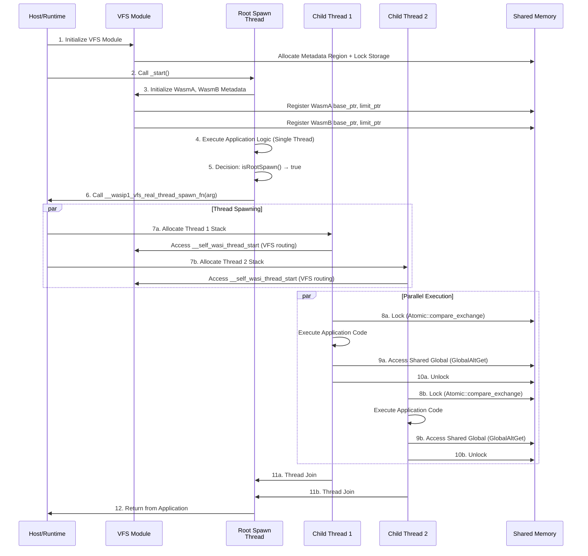
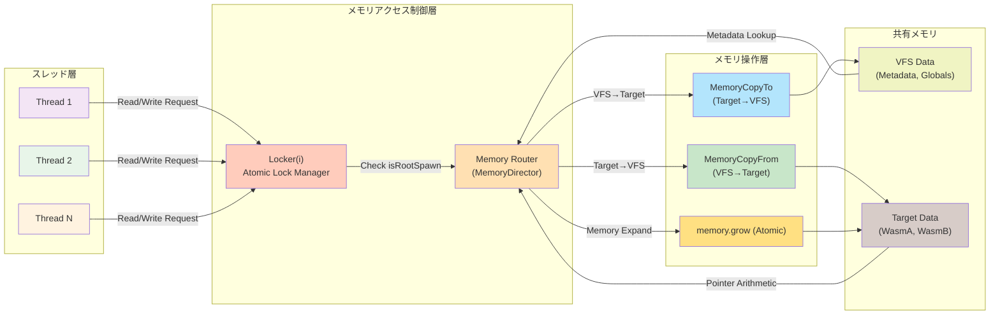
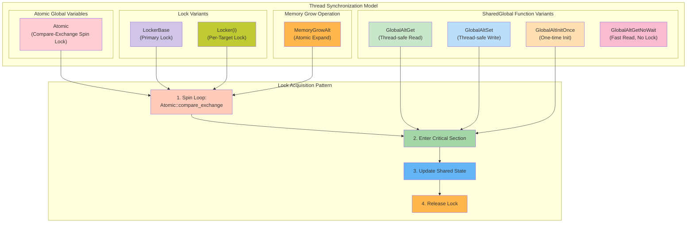
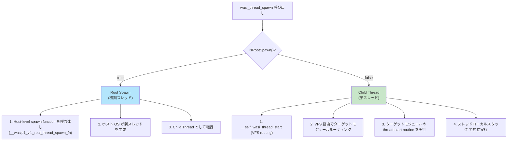
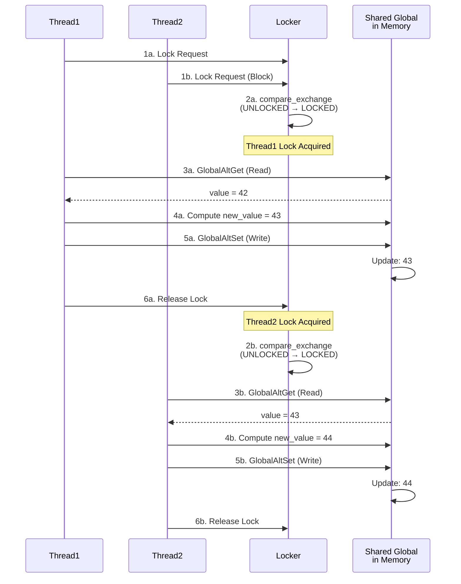

# VFS + WasmA + WasmB メモリ配置フロー図（スレッド機能付き）

このドキュメントは、WASI Virtual Layer (WVL) プロジェクトにおいて、VFS（Virtual File System）とターゲットWasmモジュール（WasmA、WasmB）を`single_memory`モードで統合し、複数スレッド実行時のメモリレイアウトと制御フロー図を示しています。

---

## 1. メモリ領域割当図（Memory Allocation Diagram）

このセクションは、`single_memory`モード下での共有メモリの物理的レイアウトを示します。複数のモジュールが1つのメモリインスタンスを共有し、各モジュールのデータはアドレス空間内の異なる領域に配置されます。



### メモリ領域の説明

| 領域 | 用途 | アクセス権 | スレッド安全性 |
|------|------|--------|------------|
| **VFS Region** | VFSのヒープ、スタック、グローバル変数 | VFS主導 | 内部ロック管理 |
| **Shared Metadata** | 各モジュールのメモリ管理情報 | 全モジュール | ターゲット登録時のみ |
| **WasmA/B Region** | 各ターゲットモジュールのデータ | 各モジュール主導 | per-module操作 |
| **Atomic Globals** | スレッド間共有グローバル変数 | 全スレッド | Atomic操作 + Locker |
| **Lock Storage** | スレッド同期用ロック | 全スレッド | RwLock (parking_lot) |

---

## 2. スレッド実行時系列図（Thread Execution Timeline）

このセクションは、Root SpawnとChild Threadの実行順序とメモリアクセスパターンを示します。



### 実行フロー解説

1. **初期化フェーズ (Steps 1-3)**
   - VFSモジュールが初期化され、共有メモリ領域とロック機構が確立される
   - WasmA、WasmB の メタデータが登録される

2. **Root Spawn フェーズ (Steps 4-6)**
   - Root Spawnスレッド（初期スレッド）が`_start()`から開始
   - `isRootSpawn()`チェックで真（true）を返す
   - ホストレベルのスレッド生成関数`__wasip1_vfs_real_thread_spawn_fn`を呼び出し

3. **子スレッド生成フェーズ (Step 7)**
   - ホストが新しいスレッドのスタック領域を割り当て
   - 各子スレッドは VFS の `__self_wasi_thread_start` ルーティング関数を経由

4. **並列実行フェーズ (Steps 8-10)**
   - 複数スレッドが共有メモリへ同時アクセス
   - **Lock**: Atomic操作でロック獲得
   - **共有グローバルアクセス**: `GlobalAltGet`で読み取り
   - **Unlock**: ロック解放

5. **同期フェーズ (Steps 11-12)**
   - 子スレッドの終了をRoot Spawnが待機
   - すべてのスレッドが終了後、ホストへ制御を返却

---

## 3. メモリアクセスパス図（Memory Access Path Diagram）

このセクションは、スレッドから共有メモリ内のデータにアクセスするまでの経路を示します。



### アクセスパスの処理フロー

```
Thread Request
    ↓
Locker(i) - スレッド間のロック競合を解決
    ↓
isRootSpawn() チェック
    ├─ true → ホストレベルのスレッド操作
    └─ false → VFS経由のルーティング
    ↓
Memory Router (MemoryDirector)
    ├─ Read from Target → MemoryCopyFrom
    ├─ Write to VFS → MemoryCopyTo
    └─ Expand Memory → Atomic memory.grow
    ↓
Shared Memory Access
```

---

## 4. ロック機構図（Locking Mechanism Diagram）

このセクションは、`single_memory`モード下でのスレッド同期とロック管理を示します。



### スレッド間ロック機構の詳細

#### Atomic Compare-Exchange Spin Lock
```
loop {
    old_value = atomic_var.load(Ordering::Acquire)
    if old_value == UNLOCKED {
        if atomic_var.compare_exchange(
            UNLOCKED, LOCKED,
            Ordering::Release,
            Ordering::Relaxed
        ).is_ok() {
            break;  // Lock acquired
        }
    }
}
```

#### GlobalAltGet（スレッドセーフな読み取り）
```
1. Lock獲得（Atomic compare-exchange）
2. グローバル変数の値をメモリから読み込み
3. Lock解放
4. 値を返却
```

#### GlobalAltSet（スレッドセーフな書き込み）
```
1. Lock獲得
2. グローバル変数にメモリへ値を書き込み
3. Lock解放
```

#### MemoryGrowAlt（Atomic メモリ拡張）
```
1. Locker(memory_id)でロック獲得
2. memory.grow 操作を実行
3. TargetMemoryMetadata.current_pages を更新
4. Lock解放
```

#### GlobalAltGetNoWait（ロック不要な高速読み取り）
```
- グローバル変数が読み取り専用の場合の最適化
- Lock なしで直接メモリ から値を読み込み
- Cache-coherency に依存
```

---

## 5. multi_memory との比較

`single_memory`と`multi_memory`の主要な違い：

### single_memory モード
- ✅ **利点**
  - メモリ操作が単純（1つのメモリインスタンス）
  - MemoryDirector ルーティングが効率的
  
- ❌ **課題**
  - スレッド同期が複雑（全モジュール が1つのメモリ を共有）
  - メモリ領域の分離管理が必要
  - reset sequence でのスタック破損リスク（既知の問題）

### multi_memory モード
- ✅ **利点**
  - 各モジュールが独立したメモリ を持つ
  - スレッド安全性が容易
  - reset sequence が安定
  
- ❌ **課題**
  - Memory 間のデータ コピーが頻繁
  - wasm-opt によるメモリ拡張が複雑
  - component 変換時に threads feature が未サポート

---

## 6. スレッド実行の詳細フロー

### Root Spawn vs Child Thread の分岐



---

## 7. メモリアクセスシーケンス例

### 複数スレッド が同時に共有グローバル変数にアクセスする場合



---

## 8. 実装コード構造

プロジェクト内の関連ファイル：

| ファイル | 役割 |
|---------|------|
| `wasi_virt_layer-cli/src/generator/threads.rs` | ThreadsSpawn ジェネレータ（Root vs Child判定） |
| `wasi_virt_layer-cli/src/generator/shared_global.rs` | SharedGlobal ジェネレータ（ロック管理） |
| `wasi_virt_layer-cli/src/generator/memory.rs` | メモリレイアウト管理、TemporaryRefugeMemory |
| `wasi_virt_layer/src/shared_memory.rs` | TargetMemoryMetadata、SharedMemoryManager |
| `wasi_virt_layer/src/wasi/shared_global.rs` | グローバル変数アクセス実装 |

---

## 9. 已知の制限事項と対策

### 既知の問題：single_memory での reset sequence の失敗

**問題シナリオ：**
```
_reset() → _start() → _main() 
```
multi_memory では成功するが、single_memory では失敗することがある

**原因：**
- 共有メモリのスタック領域が上書きされる
- スレッドローカルスタックの初期化タイミングの問題

**対策：**
- multi_memory モード の使用推奨
- 或いは、スタック領域の明示的な初期化

### Component 変換での制限

**制限：**
- Wasip1-threads feature が component 変換時にサポートされていない

**対策：**
- TemporaryRefugeMemory により、shared フラグを一時的に外す
- component 変換後に再度リンク

---

## まとめ

WASI Virtual Layer（WVL）の `single_memory`モード下での複数スレッド実行は、以下の機構により実現されています：

1. **統一されたメモリ空間**: VFS、WasmA、WasmB が1つのメモリを共有
2. **メタデータ管理**: TargetMemoryMetadata で各モジュールのメモリ領域を追跡
3. **スレッド分岐**: Root Spawn と Child Thread で異なるルーティング
4. **Atomic ロック**: 複数スレッド間のメモリアクセスを同期
5. **SharedGlobal 関数**: グローバル変数への安全なアクセス

この設計により、複数のWasm モジュールが協調して動作し、VFS を通じたファイルシステムアクセスやスレッド間通信が実現されます。
