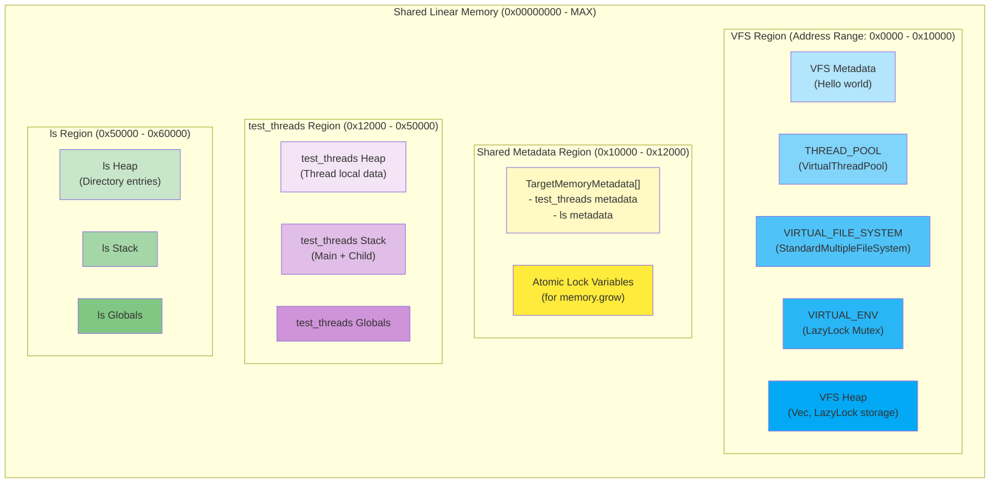
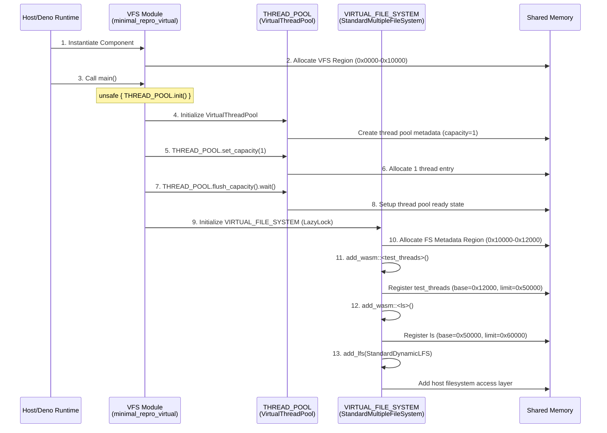
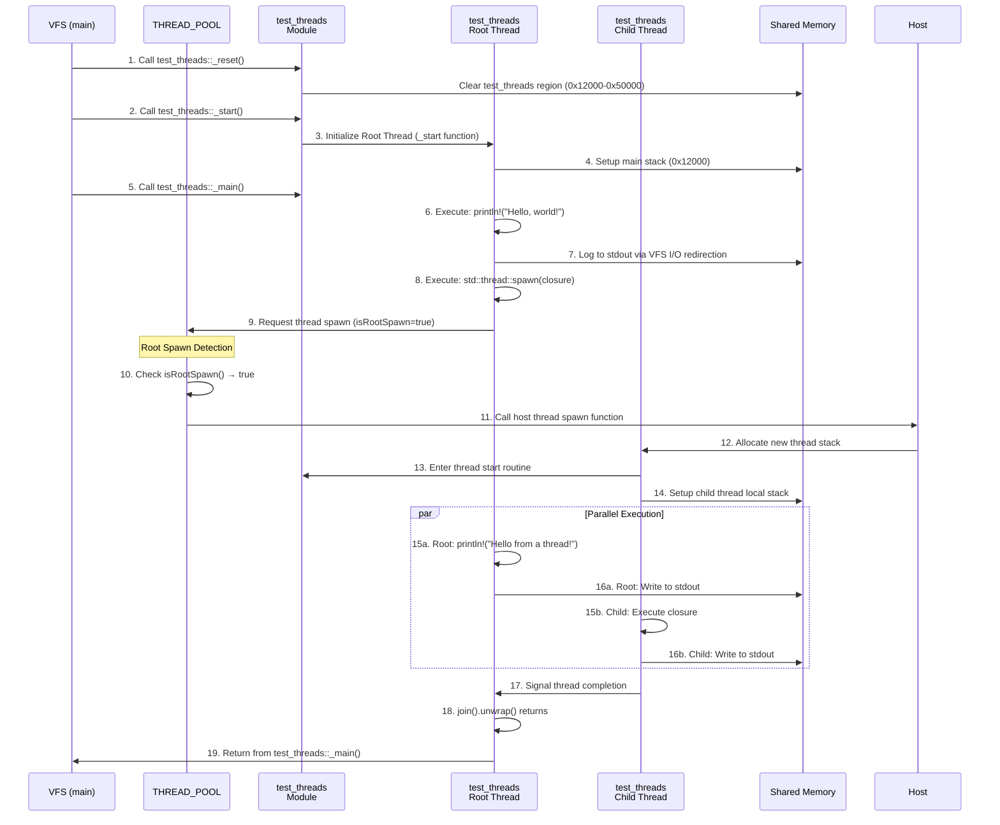
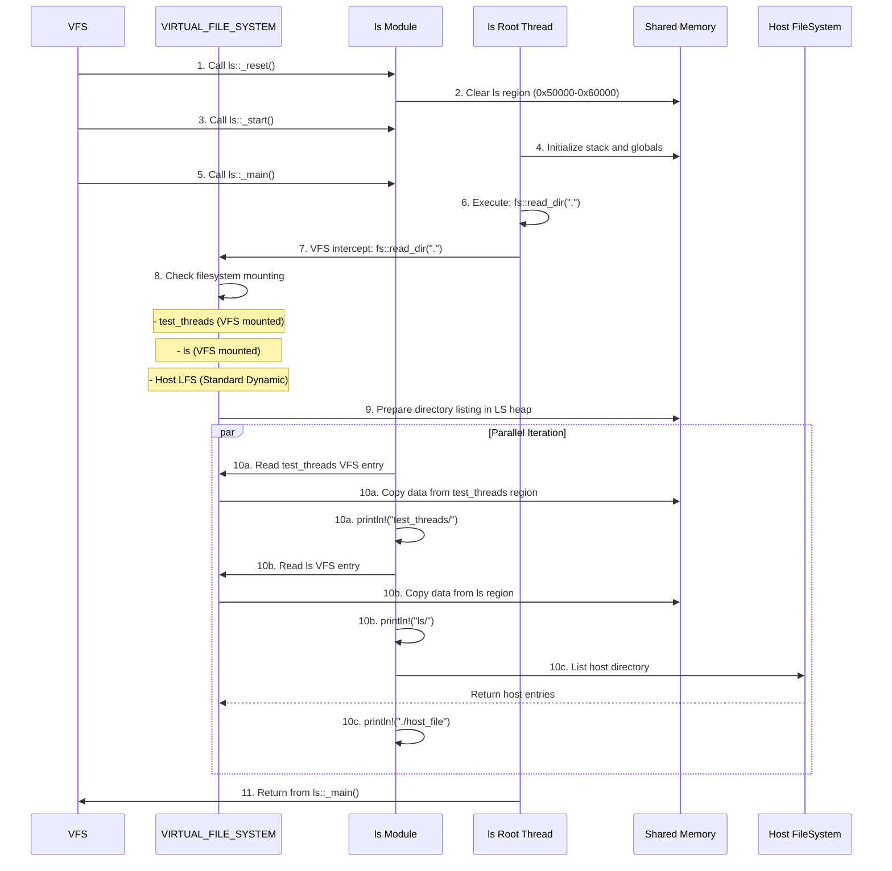
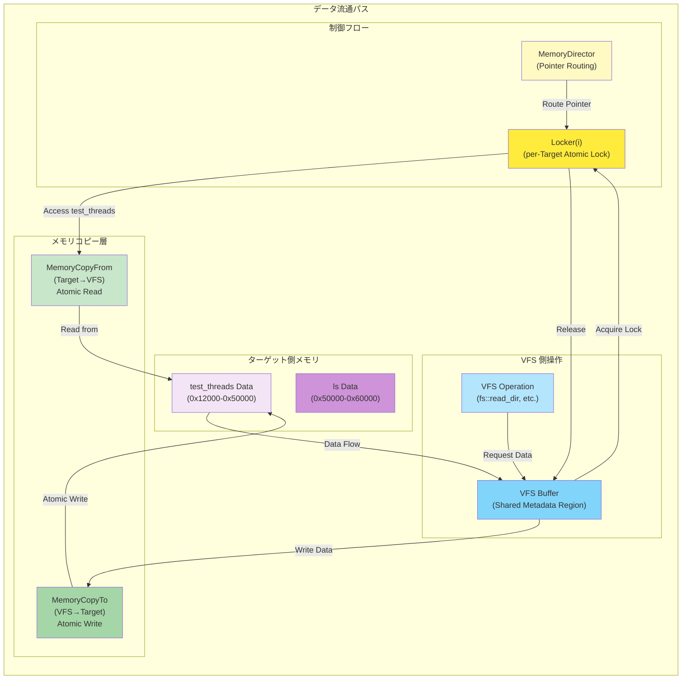
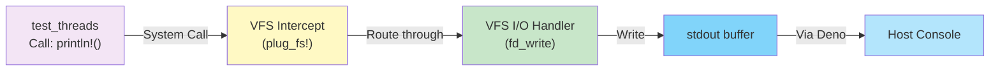
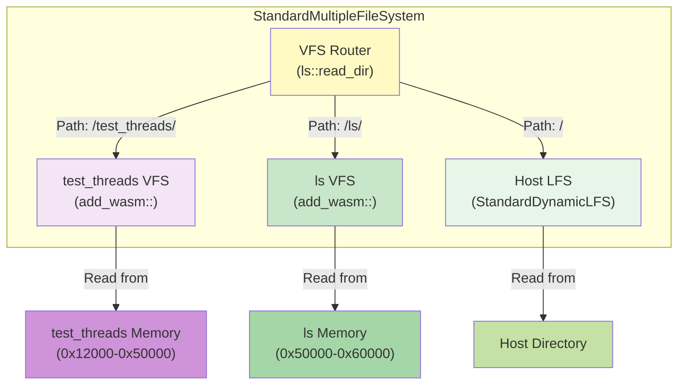
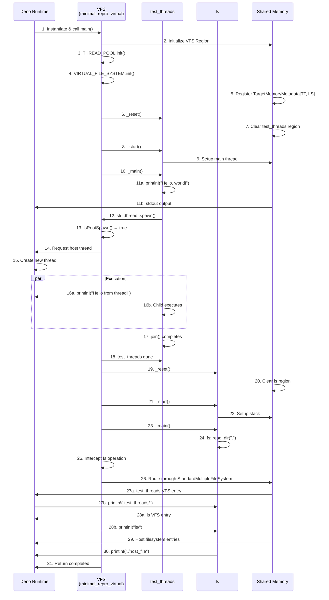

# minimal_repro_virtual 実行時メモリフロー詳細解析

## 概要

このドキュメントは、`examples/vfs/minimal_repro_virtual`プロジェクトの実行時メモリレイアウトと処理フローを詳細に解析したものです。

**プロジェクト構成：**
- **VFS Module** (minimal_repro_virtual): メインモジュール
- **Target 1** (test_threads): スレッド対応ターゲット（wasip1-threads）
- **Target 2** (ls): ファイルシステムターゲット（wasip1）
- **Mode**: single_memory、threads 有効

---

## 1. 初期メモリレイアウト（起動時）



---

## 2. 実行フェーズ1: VFS 初期化



---

## 3. 実行フェーズ2: test_threads 実行（スレッド機能）



---

## 4. 実行フェーズ3: ls 実行



---

## 5. メモリアクセスの詳細：MemoryCopyTo/From



---

## 6. スレッド実行時のメモリスナップショット

### 6a. test_threads 実行中（Child Thread 生成前）

```
Memory State: After test_threads::_main() called

Shared Linear Memory:
┌────────────────────────────────────────────┐
│ 0x0000: VFS Region                         │
│   - THREAD_POOL metadata                   │
│   - VIRTUAL_FILE_SYSTEM mounted modules    │
│   - VIRTUAL_ENV (Mutex<VirtualEnvState>)   │
│   - VFS Heap (Vec, etc.)                   │
├────────────────────────────────────────────┤
│ 0x10000: Shared Metadata                   │
│   - TargetMemoryMetadata[test_threads]     │
│     {base_ptr: 0x12000, limit_ptr: 0x50000}
│   - TargetMemoryMetadata[ls]               │
│     {base_ptr: 0x50000, limit_ptr: 0x60000}
│   - Atomic Lock Variables                  │
├────────────────────────────────────────────┤
│ 0x12000: test_threads Region (ACTIVE)      │
│   - Heap: dir listing, stdout buffer       │
│   - Main Stack: [Frame: _main, etc.]       │
│     Stack Pointer (SP): 0x12100            │
│   - Globals: module-level static vars      │
├────────────────────────────────────────────┤
│ 0x50000: ls Region (INACTIVE)              │
│   - Heap: (unused)                         │
│   - Stack: (unused)                        │
│   - Globals: (uninitialized)               │
└────────────────────────────────────────────┘
```

### 6b. Child Thread スポーン後（並列実行中）

```
Memory State: Child Thread active in test_threads

Root Thread (Main):
┌─────────────────────────────────────┐
│ Stack Frame: _main → join()         │
│ Stack Pointer: 0x12100              │
│ Waiting for child completion        │
└─────────────────────────────────────┘
         ↓ (Blocked on join)

Child Thread:
┌─────────────────────────────────────┐
│ Stack Frame: closure (spawned fn)   │
│ Stack Pointer: 0x12080 (new entry)  │
│ Executing: println!(...)            │
│ Lock Count: 1 (holds Locker)        │
└─────────────────────────────────────┘

Shared Resources:
┌─────────────────────────────────────┐
│ Locker(test_threads):               │
│   Status: LOCKED (owned by Child)   │
│   Lock Count: Atomic<i32> = 1       │
│                                      │
│ stdout buffer:                      │
│   "Hello, world!"                   │
│   "Hello from a thread!"            │
└─────────────────────────────────────┘
```

### 6c. Child Thread 終了後

```
Memory State: After Child Thread join()

Shared Memory:
┌────────────────────────────────────────────┐
│ 0x12000: test_threads Region               │
│   - Heap: cleaned up (Locker released)     │
│   - Main Stack: back at join() completion  │
│   - Child Stack Frame: deallocated         │
├────────────────────────────────────────────┤
│ Locker(test_threads):                      │
│   Status: UNLOCKED (Atomic<i32> = 0)       │
└────────────────────────────────────────────┘

Control Flow:
test_threads::_main() completes → VFS main() continues
```

---

## 7. VFS i/o インターセプション



---

## 8. StandardMultipleFileSystem ル―ティング

minimal_repro_virtual では 3 つのファイルシステムをマウント：



---

## 9. 完全な実行シーケンス



---

## 10. メモリ使用量の推定

| コンポーネント | 予想アドレス範囲 | 使用量 | 目的 |
|--------|------------|------|------|
| VFS Metadata | 0x0000 - 0x1000 | ~4 KB | ComponentABI, Hello impl |
| THREAD_POOL | 0x1000 - 0x2000 | ~4 KB | VirtualThreadPool (capacity=1) |
| VIRTUAL_FILE_SYSTEM | 0x2000 - 0x4000 | ~8 KB | StandardMultipleFileSystem + mounts |
| VIRTUAL_ENV | 0x4000 - 0x8000 | ~16 KB | LazyLock<Mutex<>> + environ Vec |
| VFS Heap/Stack | 0x8000 - 0x10000 | ~32 KB | Runtime allocation |
| TargetMemadata | 0x10000 - 0x10200 | ~512 B | [test_threads, ls] metadata |
| Atomic Locks | 0x10200 - 0x10800 | ~1.5 KB | Locker storage |
| test_threads | 0x12000 - 0x50000 | ~224 KB | Full heap + stack + globals |
| ls | 0x50000 - 0x60000 | ~64 KB | Full heap + stack + globals |
| **合計** | 0x00000 - 0x60000 | ~384 KB | Total per execution |

---

## 11. スレッド同期の詳細

### Root Spawn 判定フロー

```
std::thread::spawn() call in test_threads
    ↓
VFS intercepts: wasi_thread_spawn()
    ↓
Check: isRootSpawn()?
    ├─ YES (Root Thread) → 
    │   Call __wasip1_vfs_real_thread_spawn_fn (Host-level spawn)
    │   ↓
    │   Host OS creates new thread
    │   ↓
    │   Child Thread enters thread start routine
    │
    └─ NO (Child Thread) →
        __self_wasi_thread_start (VFS routing)
        ↓
        Child thread initialization
```

### ロック競合シナリオ（多くの場合発生しない）

minimal_repro_virtual では:
- test_threads: Root + 1 Child のみ
- ls: Single-threaded

**最大同時ロック争合度**: 1 (test_threads.Child waiting for Root unlock)

```
Timeline:
┌─────────────────────────────────────┐
│ Root Thread                         │
│ [Lock acquired for memory op]       │
│ ... reading from target memory ...  │
│ [Lock held]                         │
└─────────────────────────────────────┘
         ↑ Atomic Lock State = 1
┌─────────────────────────────────────┐
│ Child Thread                        │
│ [Spinning on lock acquire]          │
│ ... waiting for memory access ...   │
│ [Spin loop: compare_exchange loop]  │
└─────────────────────────────────────┘
         ↑ Trying to acquire = blocked
```

---

## 12. 実行結果の予想出力

```
--- Starting test_threads ---
Hello, world!
Hello from a thread!
--- Starting ls ---
test_threads/
ls/
<host filesystem entries>
```

---

## 13. 重要なポイント

### メモリ配置の最適化
1. **VFS Region** が小さく（64 KB）、ほとんどが LazyLock initialization
2. **test_threads Region** が大きい（224 KB）、Rust std thread support のため
3. **ls Region** が中程度（64 KB）、directory listing data 格納

### ス レッド安全性
- test_threads 内の thread::spawn は **isRootSpawn() = true** を検出
- Root Spawn は ホストレベルでの OS スレッド生成を要求
- Child Thread は VFS ルーティングを通じてタ ーゲットモジュールで実行

### ファイルシステム仮想化
- **StandardMultipleFileSystem** が 3 つのソースをマウント
- VFS の read_dir は各ソースを列挙
- HostLFS により host ファイルシステムへのアクセス も実現

---

## 14. トラブルシューティングと予想される問題

| 問題 | 原因 | 対策 |
|------|------|------|
| スレッド作成失敗 | isRootSpawn 判定エラー | threads.rs のロジック確認 |
| メモリアクセス違反 | MemoryCopyFrom/To の不整合 | memory.rs のアドレス計算確認 |
| ファイル読み取り失敗 | StandardMultipleFileSystem マウント漏れ | fs マウント順序確認 |
| stdout 出力なし | VFS I/O インターセプション失敗 | plug_fs! マクロ確認 |

---

## まとめ

`minimal_repro_virtual` は WASI Virtual Layer の完全なエコシステムを示す例です：

1. **複数モジュール統合**: VFS + test_threads + ls を single_memory で統合
2. **スレッド処理**: test_threads のスレッド生成と同期を実装
3. **ファイルシステム仮想化**: 複数ソースのマウントと統合
4. **メモリ管理**: TargetMemoryMetadata によるメモリ領域追跡
5. **I/O インターセプション**: WASI 呼び出しの VFS への再ルーティング

このプロジェクトを理解することで、WASI Virtual Layer の核となるメモリレイアウト、スレッド管理、ファイルシステム仮想化の全体像が明確になります。
